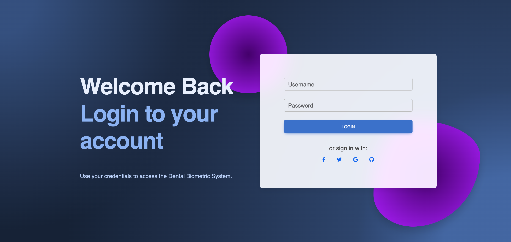
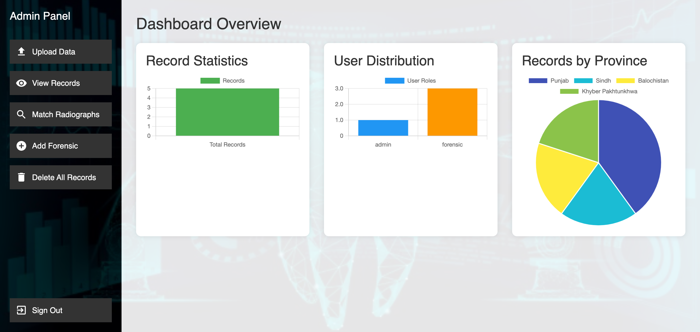
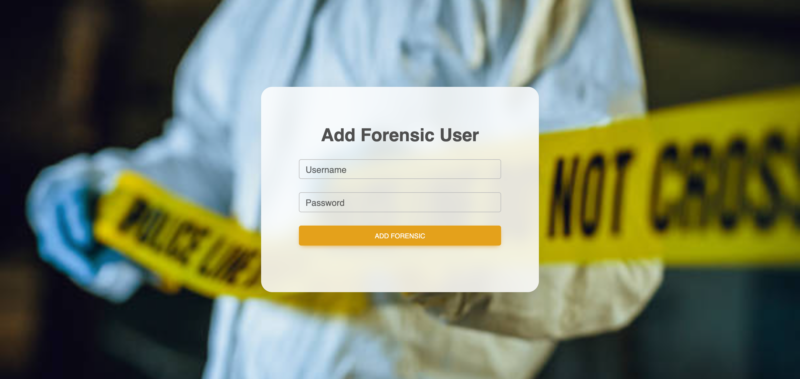
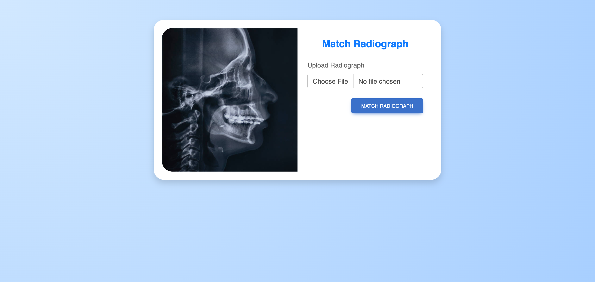
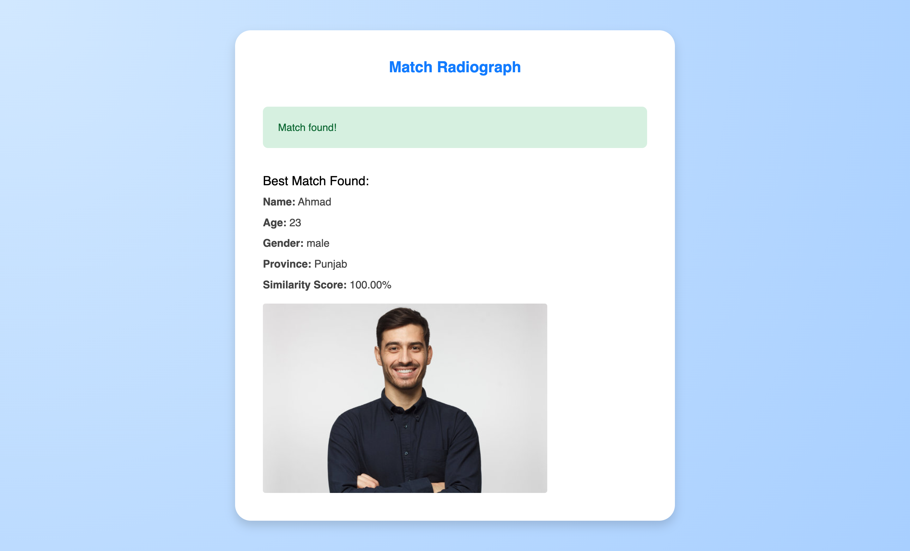

# ODONTO-SCAN — Dental Biometric Authentication System

A full-stack biometric identification platform for forensic and clinical use, enabling secure storage, management, and matching of dental radiographs.


## The Problem

Traditional dental identification relies on manual comparison of dental records — a slow, error-prone process that struggles with large datasets and high-pressure scenarios like mass disasters. Forensic professionals lack automated tools for efficient radiograph matching.

## The Solution

ODONTO-SCAN automates dental biometric identification using computer vision and a secure, centralized database. It extracts features from dental radiographs using OpenCV, matches premortem and antemortem records using Euclidean distance, and provides role-based access for administrators and forensic users.

**Result:** 95%+ matching accuracy with significantly reduced identification time.

## Key Features

- **Automated Radiograph Matching** — OpenCV-based feature extraction (noise reduction, contrast enhancement, edge detection) with Euclidean distance matching and confidence scoring
- **Secure Authentication** — JWT tokens, bcrypt password hashing, multi-factor authentication, and role-based access control (Admin / Forensic roles)
- **Data Encryption** — AES encryption for sensitive patient data and radiographs
- **Centralized Database** — MongoDB with optimized schema design, indexing, and aggregation pipelines
- **Audit Logging** — Comprehensive logs of all user actions, data access, and system changes
- **Admin Panel** — User management, record management, system monitoring, and report generation
- **RESTful API** — Express.js backend following MVC architecture

## Tech Stack

| Layer | Technology |
|-------|------------|
| Frontend | React.js, HTML5, CSS3, JavaScript |
| Backend | Node.js, Express.js |
| Database | MongoDB, Mongoose |
| Computer Vision | OpenCV |
| Security | JWT, bcrypt, AES Encryption |
| Testing | Jest, Mocha |

## System Architecture
┌─────────────────────────────────────────────────────────────┐
│ FRONTEND │
│ React.js | Dashboard | Radiograph Management | Admin Panel │
└─────────────────────────────────────────────────────────────┘
│
▼
┌─────────────────────────────────────────────────────────────┐
│ BACKEND (Node.js / Express) │
│ REST APIs | JWT Auth | Middleware | Feature Extraction │
└─────────────────────────────────────────────────────────────┘
│
▼
┌─────────────────────────────────────────────────────────────┐
│ DATABASE (MongoDB) │
│ User Schema | Record Schema | Feature Vectors | Audit Logs │
└─────────────────────────────────────────────────────────────┘

## How It Works

1. **Upload** — Forensic user uploads a dental radiograph with metadata
2. **Preprocess** — Image is enhanced (noise reduction, contrast, edge detection)
3. **Extract** — CNN-based feature extraction generates a feature vector
4. **Match** — Feature vector is compared against stored records using Euclidean distance
5. **Score** — Confidence score is assigned; best match is displayed with patient details

## Screenshots

### 🔐 Secure Login


### 📊 Admin Dashboard


### 👤 Role-Based Access Control (Add Forensic User)


### 🔍 Match Radiograph (Upload)


### ✅ Match Result (95%+ Accuracy)


## Code Highlight

### Biometric Matching Logic (OpenCV)

```javascript
const extractFeatures = async (imagePath) => {
  const image = await cv.imreadAsync(imagePath);
  const processed = await preprocessImage(image);
  const featureVector = await extractFeatureVector(processed);
  return featureVector;
};
```
Testing Results
Test Type	Framework	Result
Unit Tests	Jest	Feature extraction and matching functions verified
Integration Tests	Mocha	End-to-end matching and authentication verified
User Acceptance	Forensic Professionals	Positive feedback on usability and speed
Accuracy: 95%+ on premortem-antemortem matching

Project Status
Area	Status
Backend API	✅ Complete
Frontend UI	✅ Complete
Biometric Matching	✅ Working (95%+ accuracy)
Testing	✅ Jest + Mocha
Documentation	🟡 In progress

## FAQ

<details>
<summary><strong>What is ODONTO-SCAN used for?</strong></summary>

ODONTO-SCAN is a biometric identification platform for forensic and clinical use. It matches dental radiographs against stored records using OpenCV-based feature extraction, achieving 95%+ accuracy in premortem-antemortem matching.

</details>

<details>
<summary><strong>Who can use it?</strong></summary>

The system has two roles:
- **Admin** — manages users, records, and system settings
- **Forensic** — uploads radiographs and performs matching

Each role has different permissions enforced through JWT-based role-based access control (RBAC).

</details>

<details>
<summary><strong>How does the matching work?</strong></summary>

1. Upload a dental radiograph
2. Image is preprocessed (noise reduction, contrast enhancement, edge detection)
3. OpenCV extracts a feature vector from the dental pattern
4. The vector is compared against stored records using Euclidean distance
5. A confidence score is returned with the best match

</details>

<details>
<summary><strong>Is patient data secure?</strong></summary>

Yes. The system uses:
- **JWT authentication** with token expiration
- **bcrypt** password hashing (10 salt rounds)
- **AES encryption** for sensitive data at rest
- **Audit logging** for all user actions and data access

</details>

<details>
<summary><strong>What tech stack does it use?</strong></summary>

- **Frontend:** React.js, HTML5, CSS3
- **Backend:** Node.js, Express.js
- **Database:** MongoDB with Mongoose
- **Computer Vision:** OpenCV
- **Security:** JWT, bcrypt, AES
- **Testing:** Jest, Mocha

</details>

<details>
<summary><strong>Can I run it locally?</strong></summary>

Yes. See the [Installation](#installation) section above. You'll need Node.js 18+, MongoDB, and a `.env` file (copy from `.env.example`).

</details>


What I Learned Building This
Designing a full REST API with role-based access control (Admin / Forensic users)

Integrating OpenCV with a Node.js backend for real-time image processing

Structuring a MongoDB schema that stores encrypted patient records and biometric feature vectors

Writing tests that actually catch bugs before they reach the UI

The importance of audit logging in systems that handle sensitive data

Roadmap
□ Dockerize backend and frontend
□ Add GitHub Actions CI pipeline
□ Deploy live demo on Render
□ Add multi-biometric support (fingerprints + facial recognition)
□ Integration with national forensic databases via APIs
Installation
Prerequisites
Node.js (v18+)

MongoDB (local or Atlas)

npm or yarn

Backend Setup
cd backend
npm install
# Create .env file with:
# MONGO_URI=your_mongodb_connection_string
# JWT_SECRET=your_jwt_secret
# PORT=5000
npm start

Frontend Setup
cd frontend
npm install
npm run dev

API Endpoints
Method	Endpoint	Description	Access
POST	/api/auth/register	Register new user	Public
POST	/api/auth/login	Login and receive JWT	Public
GET	/api/records	Get all records	Admin
POST	/api/records	Upload new radiograph	Forensic / Admin
PUT	/api/records/:id	Update record	Admin
DELETE	/api/records/:id	Delete record	Admin
POST	/api/match	Match radiograph	Forensic / Admin
Security Measures
JWT-based authentication with token expiration

bcrypt password hashing (10 salt rounds)

AES encryption for sensitive data at rest

Role-based access control (RBAC)

Audit logging for accountability

Input validation and sanitization

Author
Muhammad Ahmad Javed
BS Computer Science (Hons.), University of Agriculture, Faisalabad (2025)

Portfolio: imahmad.xyz

LinkedIn: linkedin.com/in/m-ahmadjaved

GitHub: github.com/m-ahmadjaved

Medium: medium.com/@m-ahmadjaved

License
MIT License — see LICENSE for details.
